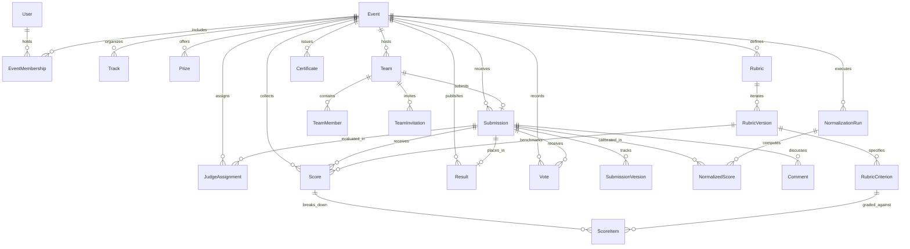

# RaptorOS Domain Architecture & Data Model Specification

## 1. Architectural Principles & Guarantees

RaptorOS is designed as an offline-first, production-grade hackathon operating system capable of managing single hackathons or multi-event academic/corporate hackathon platforms.

The Phase 2 database domain architecture satisfies four non-negotiable architectural invariants:

1. **Event-Scoped Role Isolation**: Users do not possess a single static global role. Roles (`PARTICIPANT`, `JUDGE`, `ORGANIZER`, `ADMIN`) are strictly bound to an `Event` via `EventMembership`. A user can act as an Organizer in Event A while competing as a Participant in Event B.
2. **Scoring Immutability & Reproducibility**: Raw judge evaluations (`Score`, `ScoreItem`) and rubric criteria (`RubricVersion`, `RubricCriterion`) are strictly immutable. Score normalization (`NormalizationRun`, `NormalizedScore`) computes isolated calibrated views without mutating raw scores.
3. **Multi-Event Isolation**: All domain entities (Tracks, Prizes, Teams, Submissions, Rubrics, Results, Certificates) are partitioned by `eventId`. Slugs and submission constraints use compound uniqueness (e.g., `@@unique([eventId, slug])` on Track and Team; `@@unique([eventId, teamId])` on Submission).
4. **Referential Integrity & Tamper-Evident Auditing**: Critical entities are safeguarded against accidental cascading destruction via `onDelete: Restrict` (scored submissions, rubric versions with scores, certificate recipients). Key operational events append structured records to `AuditLog`.

---

## 2. Mermaid Entity-Relationship Diagram



---

## 3. Entity Catalog

### 3.1 Infrastructure & Users

#### `SystemSetting` (`system_settings`)
Operational metadata and infrastructure state.
- `key` (String, PK): Configuration identifier.
- `value` (String): Raw configuration value.
- `description` (String, optional): Explanation.
- `createdAt`, `updatedAt` (DateTime).

#### `User` (`users`)
Platform identity representation. Does not hold hardcoded global business roles.
- `id` (String, CUID, PK)
- `email` (String, Unique): User's primary contact email.
- `name` (String, optional)
- `avatarUrl` (String, optional)
- `bio` (String, optional)
- `createdAt`, `updatedAt` (DateTime)

#### `Event` (`events`)
Root entity for each hackathon instance.
- `id` (String, CUID, PK)
- `name` (String)
- `slug` (String, Unique): URL-safe public handle.
- `description` (String, optional)
- `state` (`EventState`, default `DRAFT`): State machine indicator (`DRAFT`, `REGISTRATION_OPEN`, `REGISTRATION_CLOSED`, `SUBMISSIONS_OPEN`, `SUBMISSIONS_CLOSED`, `JUDGING_OPEN`, `JUDGING_CLOSED`, `RESULTS_PUBLISHED`, `ARCHIVED`).
- `location` (String, optional): Venue name or URL.
- `isVirtual` (Boolean, default true): In-person vs remote hackathon format.
- `timezone` (String, default "UTC"): Standard timezone for deadline evaluation.
- `registrationStart`, `registrationEnd` (DateTime, optional): Registration window.
- `submissionsStart`, `submissionsEnd` (DateTime, optional): Project submission window.
- `judgingStart`, `judgingEnd` (DateTime, optional): Rubric evaluation window.
- `startsAt`, `endsAt` (DateTime, optional): Overall hackathon operational window.
- `minTeamSize` (Int, default 1): Lower bound on valid team roster size.
- `maxTeamSize` (Int, default 4): Upper bound capacity on team members.
- `settings` (Json, optional): Additional hackathon rules and custom branding.
- `createdAt`, `updatedAt` (DateTime)

#### `EventMembership` (`event_memberships`)
Event-scoped user authorization and role mapping.
- `id` (String, CUID, PK)
- `userId` (String, FK -> `User`)
- `eventId` (String, FK -> `Event`)
- `role` (`EventRole` enum: `PARTICIPANT`, `JUDGE`, `ORGANIZER`, `ADMIN`)
- `status` (`MembershipStatus` enum: `ACTIVE`, `INACTIVE`, `SUSPENDED`)
- `createdAt`, `updatedAt` (DateTime)
- **Constraints**: `@@unique([userId, eventId, role])`

---

### 3.2 Tracks & Prizes

#### `Track` (`tracks`)
Thematic competition tracks scoped to an event.
- `id` (String, CUID, PK)
- `eventId` (String, FK -> `Event`, Cascade)
- `name` (String)
- `slug` (String): Track identifier within the event.
- `description` (String, optional)
- `isActive` (Boolean, default true)
- `order` (Int, default 0)
- **Constraints**: `@@unique([eventId, slug])`

#### `Prize` (`prizes`)
Awards and bounties associated with an event and optionally linked to a track.
- `id` (String, CUID, PK)
- `eventId` (String, FK -> `Event`, Cascade)
- `trackId` (String, optional, FK -> `Track`, SetNull)
- `name` (String)
- `description` (String, optional)
- `value` (Decimal(12, 2), optional): Monetary or prize valuation.
- `order` (Int, default 0)

---

### 3.3 Teams & Invitations

#### `Team` (`teams`)
Competitive team unit participating in an event.
- `id` (String, CUID, PK)
- `eventId` (String, FK -> `Event`, Cascade)
- `trackId` (String, optional, FK -> `Track`, SetNull)
- `creatorId` (String, FK -> `User`, Restrict)
- `name` (String)
- `slug` (String): Team slug within event.
- `description` (String, optional)
- **Constraints**: `@@unique([eventId, slug])`

#### `TeamMember` (`team_members`)
Membership of a participant inside a team.
- `id` (String, CUID, PK)
- `teamId` (String, FK -> `Team`, Cascade)
- `userId` (String, FK -> `User`, Cascade)
- `role` (`TeamMemberRole` enum: `LEADER`, `MEMBER`)
- `joinedAt` (DateTime)
- **Constraints**: `@@unique([teamId, userId])`

#### `TeamInvitation` (`team_invitations`)
Email invitations to join a team.
- `id` (String, CUID, PK)
- `teamId` (String, FK -> `Team`, Cascade)
- `email` (String)
- `role` (`TeamMemberRole`, default `MEMBER`)
- `token` (String, Unique): Cryptographic join token.
- `status` (`InvitationStatus` enum: `PENDING`, `ACCEPTED`, `REJECTED`, `EXPIRED`)
- `expiresAt` (DateTime)
- **Constraints**: `@@unique([teamId, email])`, `@@index([token])`

---

### 3.4 Submissions & Versioning

#### `Submission` (`submissions`)
Canonical project record for a team in an event.
- `id` (String, CUID, PK)
- `eventId` (String, FK -> `Event`, Cascade)
- `teamId` (String, Unique, FK -> `Team`, Cascade)
- `trackId` (String, optional, FK -> `Track`, SetNull)
- `title` (String)
- `description` (String)
- `repositoryUrl`, `demoUrl`, `deploymentUrl`, `documentationUrl` (String, optional)
- `customData` (Json, optional)
- `state` (`SubmissionState` enum: `DRAFT`, `SUBMITTED`, `LOCKED`, `DISQUALIFIED`)
- `submittedAt`, `lockedAt` (DateTime, optional)
- **Constraints**: `@@unique([eventId, teamId])`

#### `SubmissionVersion` (`submission_versions`)
Append-only historical snapshots preserving submission state at key milestones.
- `id` (String, CUID, PK)
- `submissionId` (String, FK -> `Submission`, Cascade)
- `versionNumber` (Int)
- `title`, `description` (String)
- `snapshotData` (Json): Complete serialized snapshot.
- `submittedById` (String, FK -> `User`, Restrict)
- `createdAt` (DateTime)
- **Constraints**: `@@unique([submissionId, versionNumber])`

---

### 3.5 Rubrics & Criteria

#### `Rubric` (`rubrics`)
Evaluation criteria container scoped to an event (and optionally a track).
- `id` (String, CUID, PK)
- `eventId` (String, FK -> `Event`, Cascade)
- `trackId` (String, optional, FK -> `Track`, SetNull)
- `name` (String)
- `description` (String, optional)

#### `RubricVersion` (`rubric_versions`)
Immutable version of a rubric. Once assigned to scores, criteria cannot be edited in-place.
- `id` (String, CUID, PK)
- `rubricId` (String, FK -> `Rubric`, Cascade)
- `versionNumber` (Int, default 1)
- `isActive` (Boolean, default true)
- **Constraints**: `@@unique([rubricId, versionNumber])`

#### `RubricCriterion` (`rubric_criteria`)
Individual scoring dimension with decimal weight and maximum score scale.
- `id` (String, CUID, PK)
- `rubricVersionId` (String, FK -> `RubricVersion`, Cascade)
- `name` (String)
- `description` (String, optional)
- `weight` (Decimal(5, 2), default 1.0): Relative criterion weight.
- `maxScore` (Decimal(5, 2), default 10.0): Maximum score ceiling.
- `order` (Int, default 0)
- **Constraints**: `@@unique([rubricVersionId, name])`

---

### 3.6 Judging & Scoring

#### `JudgeAssignment` (`judge_assignments`)
Assignment of an authorized Judge to a Submission.
- `id` (String, CUID, PK)
- `eventId` (String, FK -> `Event`, Cascade)
- `judgeId` (String, FK -> `User`, Restrict)
- `submissionId` (String, FK -> `Submission`, Cascade)
- `status` (`AssignmentStatus` enum: `PENDING`, `IN_PROGRESS`, `COMPLETED`, `EXCUSED`)
- `batchId` (String, optional): Identifies the assignment round.
- **Constraints**: `@@unique([eventId, judgeId, submissionId])`

#### `Score` (`scores`)
Raw evaluation record submitted by a judge under a specific rubric version.
- `id` (String, CUID, PK)
- `eventId` (String, FK -> `Event`, Cascade)
- `judgeId` (String, FK -> `User`, Restrict)
- `submissionId` (String, FK -> `Submission`, Restrict)
- `rubricVersionId` (String, FK -> `RubricVersion`, Restrict)
- `feedback` (String, optional)
- `isFinal` (Boolean, default false)
- **Constraints**: `@@unique([judgeId, submissionId, rubricVersionId])`

#### `ScoreItem` (`score_items`)
Score awarded per rubric criterion within an evaluation.
- `id` (String, CUID, PK)
- `scoreId` (String, FK -> `Score`, Cascade)
- `criterionId` (String, FK -> `RubricCriterion`, Restrict)
- `rawScore` (Decimal(5, 2))
- `feedback` (String, optional)
- **Constraints**: `@@unique([scoreId, criterionId])`

---

### 3.7 Normalization & Results (Phase 7)

#### `NormalizationRun` (`normalization_runs`)
Auditable record of a score normalization batch execution.
- `id` (String, CUID, PK)
- `eventId` (String, FK -> `Event`, Cascade)
- `version` (Int, default 1): Monotonically increasing run version per event.
- `method` (String): Normalization algorithm (`Z_SCORE`, `MIN_MAX`).
- `parameters` (Json): Statistical parameters (e.g., `outlierThreshold`, `trackId`).
- `metadata` (Json, optional): Pre-computed overall event statistics (mean, std dev, per-judge summaries).
- `inputScoreCount` (Int, default 0): Total evaluations processed in run.
- `status` (`RunStatus` enum: `PENDING`, `COMPLETED`, `FAILED`)
- `executedById` (String, FK -> `User`, Restrict)
- **Constraints**: `@@unique([eventId, version])`

#### `NormalizedScore` (`normalized_scores`)
Calibrated submission score derived from a normalization run. Never overwrites raw score.
- `id` (String, CUID, PK)
- `normalizationRunId` (String, FK -> `NormalizationRun`, Cascade)
- `submissionId` (String, FK -> `Submission`, Cascade)
- `judgeId` (String, optional, FK -> `User`, SetNull): Judge who provided the evaluation.
- `assignmentId` (String, optional, FK -> `JudgeAssignment`, SetNull)
- `scoreId` (String, optional, FK -> `Score`, SetNull)
- `rawScore` (Decimal(7, 4), optional): Weighted uncalibrated raw score evaluated by the judge.
- `normalizedValue` (Decimal(7, 4)): Calibrated T-score ($50 + 15z$) or Min-Max scaled score.
- `zScore` (Float, optional): Standardized distance from judge mean in units of standard deviation.
- `percentile` (Float, optional)
- `calibrationData` (Json, optional): Judge mean, std dev, and outlier flag at execution time.

#### `ResultSnapshot` (`result_snapshots`)
Durable, versioned result snapshot with explicit lifecycle (`DRAFT` -> `FINALIZED` -> `PUBLISHED`).
- `id` (String, CUID, PK)
- `eventId` (String, FK -> `Event`, Cascade)
- `normalizationRunId` (String, optional, FK -> `NormalizationRun`, SetNull)
- `version` (Int, default 1): Monotonically increasing snapshot version.
- `status` (`ResultStatus` enum: `DRAFT`, `FINALIZED`, `PUBLISHED`)
- `name` (String, optional): Descriptive label (e.g. "Final Audited Placements").
- `notes` (String, optional): Governance review comments.
- `createdById` (String, FK -> `User`, Restrict)
- `finalizedAt` (DateTime, optional): Timestamp when snapshot was locked for organizer review.
- `publishedAt` (DateTime, optional): Timestamp when snapshot was released to the public gallery.
- **Constraints**: `@@unique([eventId, version])`

#### `ProjectResult` (`project_results`)
Itemized project ranking entry inside a `ResultSnapshot`.
- `id` (String, CUID, PK)
- `snapshotId` (String, FK -> `ResultSnapshot`, Cascade)
- `submissionId` (String, FK -> `Submission`, Restrict)
- `trackId` (String, optional, FK -> `Track`, SetNull)
- `prizeId` (String, optional, FK -> `Prize`, SetNull)
- `rank` (Int): Overall numerical placement (1-based, deterministic tie-broken).
- `trackRank` (Int, optional): Track-specific placement.
- `rawAggregateScore` (Decimal(7, 4)): Mean raw weighted score across judges.
- `normalizedScore` (Decimal(7, 4), optional): Mean normalized score across judges.
- `finalScore` (Decimal(7, 4)): Decisive score used for ranking.
- `scoreCount` (Int, default 0): Number of evaluations included.
- `metadata` (Json, optional): Title, team name, judge consensus variance, and warnings.
- **Constraints**: `@@unique([snapshotId, submissionId])`

#### `Result` (`results`)
Legacy mirror table maintained for backward compatibility with external integrations and verifiable certificates.
- `id` (String, CUID, PK)
- `eventId` (String, FK -> `Event`, Cascade)
- `submissionId` (String, Unique, FK -> `Submission`, Restrict)
- `trackId` (String, optional, FK -> `Track`, SetNull)
- `prizeId` (String, optional, FK -> `Prize`, SetNull)
- `rank` (Int, optional)
- `rawAggregateScore` (Decimal(7, 4))
- `normalizedScore` (Decimal(7, 4), optional)
- `finalScore` (Decimal(7, 4))
- `isPublished` (Boolean, default false)
- `publishedAt` (DateTime, optional)
- **Constraints**: `@@unique([eventId, submissionId])`

---

### 3.8 Community Voting, Comments & Anti-Abuse

#### `VotingConfig` (`voting_configs`)
Per-event community voting rules, lifecycle windows, anti-bias policies, and visibility settings.
- `id` (String, CUID, PK)
- `eventId` (String, Unique, FK -> `Event`, Cascade)
- `isEnabled` (Boolean, default false): Master toggle for community voting.
- `votingStartsAt`, `votingEndsAt` (DateTime, optional): Explicit voting window.
- `eligibilityMode` (`VotingEligibilityMode` enum, default `REGISTERED_PARTICIPANTS`):
  - `PUBLIC`: Any authenticated account.
  - `REGISTERED_PARTICIPANTS`: Users holding an `EventMembership` for this event.
  - `SUBMITTING_TEAMS_ONLY`: Users who are members of an accepted/submitted team.
- `preventSelfVoting` (Boolean, default true): Prohibits participants from voting for their own team's submissions.
- `publicResultsPublished` (Boolean, default false): When false, vote counts and leaderboards are strictly hidden from participants and public gallery.
- `hideVoteCountsUntilClosed` (Boolean, default true): Conceals live counts while voting is active.
- `randomizeGallery` (Boolean, default true): Deterministically shuffles gallery submissions to mitigate top-row exposure bias.
- `gallerySeed` (String, optional): Cryptographic or organizer seed for reproducible gallery permutations.
- `maxVotesPerVoter` (Int, default 1): Upper bound of votes a voter may cast per event.
- `allowVoteRetraction` (Boolean, default true): Permits voter to retract their vote within the active voting window.
- `createdAt`, `updatedAt` (DateTime)

#### `Vote` (`votes`)
Community or peer votes cast for a submission. Strictly isolated from judge scoring and official awards.
- `id` (String, CUID, PK)
- `eventId` (String, FK -> `Event`, Cascade)
- `submissionId` (String, FK -> `Submission`, Cascade)
- `voterId` (String, FK -> `User`, Restrict)
- `votingSessionId` (String, optional): Audit identifier for session/context correlation.
- `createdAt` (DateTime, default now)
- **Constraints**: `@@unique([eventId, voterId, submissionId])` (enforces strict 1 vote per voter per project).
- **Indexes**: `@@index([eventId, voterId])`, `@@index([eventId, submissionId])`

#### `Comment` (`comments`)
Public or private discussion comments on project submissions with built-in moderation.
- `id` (String, CUID, PK)
- `eventId` (String, FK -> `Event`, Cascade)
- `submissionId` (String, FK -> `Submission`, Cascade)
- `userId` (String, FK -> `User`, Restrict)
- `content` (Text): Plain-text sanitized content (2–1000 characters). HTML and scripts stripped.
- `moderationStatus` (`CommentModerationStatus` enum, default `PUBLISHED`):
  - `PUBLISHED`: Visible in public discussion.
  - `HIDDEN`: Hidden from public feed pending review.
  - `REMOVED`: Permanently removed from public display by organizer.
- `moderatedById` (String, optional, FK -> `User`, SetNull): Organizer who took moderation action.
- `moderatedAt` (DateTime, optional): Timestamp of moderation action.
- `moderationReason` (String, optional): Stated justification for moderation.
- `isDeleted` (Boolean, default false): Author self-deletion indicator.
- `createdAt`, `updatedAt` (DateTime)
- **Indexes**: `@@index([eventId, submissionId])`, `@@index([userId])`, `@@index([moderationStatus])`

#### `AbuseSignal` (`abuse_signals`)
Heuristic anomaly flags generated by rate limiting, velocity tracking, and voting pattern monitors.
- `id` (String, CUID, PK)
- `eventId` (String, FK -> `Event`, Cascade)
- `targetType` (String): Entity or actor type (`VOTE`, `COMMENT`, `USER`, `SUBMISSION`).
- `targetId` (String): Identifier of the flagged entity or actor.
- `ruleTriggered` (String): Heuristic identifier (e.g., `RAPID_VOTE_BURST`, `COMMENT_VELOCITY_EXCEEDED`, `UNAUTHENTICATED_PROBE`).
- `severity` (`AbuseSignalSeverity` enum, default `MEDIUM`):
  - `LOW`, `MEDIUM`, `HIGH`, `CRITICAL`.
- `status` (`AbuseSignalStatus` enum, default `PENDING_REVIEW`):
  - `PENDING_REVIEW`: Awaiting organizer assessment.
  - `DISMISSED`: Marked false-positive by organizer.
  - `CONFIRMED_ABUSE`: Validated anomaly by organizer.
- `metadata` (Json, optional): Velocity metrics, IP addresses, client agents, or window timestamps.
- `reviewedById` (String, optional, FK -> `User`, SetNull)
- `reviewedAt` (DateTime, optional)
- `reviewNotes` (String, optional)
- `createdAt`, `updatedAt` (DateTime)
- **Indexes**: `@@index([eventId, status])`, `@@index([targetType, targetId])`, `@@index([createdAt])`

---

### 3.9 Audit Logs & Certificates

#### `AuditLog` (`audit_logs`)
Tamper-evident append-only log of significant platform actions.
- `id` (String, CUID, PK)
- `eventId` (String, optional, FK -> `Event`, SetNull)
- `actorId` (String, optional, FK -> `User`, SetNull)
- `action` (String): Structured action key (e.g., `EVENT_STATE_CHANGED`, `SCORE_SUBMITTED`).
- `entityType` (String): Affected entity type (`Event`, `Score`, `Submission`).
- `entityId` (String): ID of the affected entity.
- `metadata` (Json, optional): Contextual diffs or request parameters.
- `timestamp` (DateTime, default now)
- **Indexes**: `@@index([eventId, timestamp])`, `@@index([entityType, entityId])`

#### `Certificate` (`certificates`)
Cryptographically verifiable certificate issued to participants, winners, and judges.
- `id` (String, CUID, PK)
- `eventId` (String, FK -> `Event`, Cascade)
- `recipientId` (String, FK -> `User`, Restrict)
- `type` (`CertificateType` enum: `PARTICIPATION`, `WINNER`, `HONORABLE_MENTION`, `JUDGE`, `ORGANIZER`)
- `title` (String)
- `description` (String, optional)
- `verificationId` (String, Unique): Cryptographic public verification token.
- `resultId` (String, optional, FK -> `Result`, SetNull)
- `prizeId` (String, optional, FK -> `Prize`, SetNull)
- `isRevoked` (Boolean, default false)
- `revocationReason` (String, optional)
- `issuedAt` (DateTime, default now)
- **Indexes**: `@@index([verificationId])`, `@@index([eventId, recipientId])`

---

## 4. State Machines

### 4.1 Event Lifecycle (`EventState`)

```
  ┌─────────┐
  │  DRAFT  │
  └────┬────┘
       ▼
┌──────────────────┐     ┌─────────────────────┐
│REGISTRATION_OPEN ├────►│ REGISTRATION_CLOSED │
└────────┬─────────┘     └──────────┬──────────┘
         │                          │
         ▼                          ▼
┌──────────────────┐     ┌─────────────────────┐
│ SUBMISSIONS_OPEN ├────►│ SUBMISSIONS_CLOSED  │
└──────────────────┘     └──────────┬──────────┘
                                    │
                                    ▼
┌──────────────────┐     ┌─────────────────────┐
│   JUDGING_OPEN   ├────►│   JUDGING_CLOSED    │
└──────────────────┘     └──────────┬──────────┘
                                    │
                                    ▼
                         ┌─────────────────────┐
                         │  RESULTS_PUBLISHED  │
                         └──────────┬──────────┘
                                    │
                                    ▼
                         ┌─────────────────────┐
                         │      ARCHIVED       │
                         └─────────────────────┘
```

### 4.2 Submission Lifecycle (`SubmissionState`)

```
┌───────┐      Submit       ┌───────────┐      Freeze      ┌────────┐
│ DRAFT ├──────────────────►│ SUBMITTED ├─────────────────►│ LOCKED │
└───┬───┘                   └─────┬─────┘                  └───┬────┘
    │                             │                            │
    │ Disqualify                  │ Disqualify                 │ Disqualify
    ▼                             ▼                            ▼
┌───────────────────────────────────────────────────────────────────┐
│                           DISQUALIFIED                            │
└───────────────────────────────────────────────────────────────────┘
```

---

## 5. Scoring & Normalization Pipeline

```
┌────────────────────────┐
│  RubricCriterion       │
│  (weight: Decimal)     │
└───────────┬────────────┘
            │
            ▼
┌────────────────────────┐
│  Raw ScoreItem         │
│  (rawScore: Decimal)   │◄─── Evaluated by Judge (Immutable)
└───────────┬────────────┘
            │
            ▼
┌────────────────────────┐
│  Score (isFinal=true)  │
└───────────┬────────────┘
            │
            ├─────────────────────────────────────────┐
            │                                         │
            ▼                                         ▼
┌────────────────────────┐               ┌────────────────────────┐
│  Raw Aggregate Score   │               │  NormalizationRun      │
│  (Calculated average)  │               │  (Algorithm: Z-Score)  │
└───────────┬────────────┘               └────────────┬───────────┘
            │                                         │
            │                                         ▼
            │                            ┌────────────────────────┐
            │                            │  NormalizedScore       │
            │                            │  (Calibrated Value)    │
            │                            └────────────┬───────────┘
            │                                         │
            └────────────────────┬────────────────────┘
                                 │
                                 ▼
                     ┌────────────────────────┐
                     │  Result (Final Rank)   │
                     └────────────────────────┘
```

---

## 6. Migration History

| Migration Identifier | Name | Summary |
|---|---|---|
| `20260101000000_init` | Foundation Schema | Phase 1 baseline table `system_settings`. |
| `20260102000000_domain_architecture` | Complete Domain Schema | Phase 2 domain tables: Users, Events, Memberships, Tracks, Prizes, Teams, Submissions, Rubrics, Scoring, Normalization, Results, Votes, Comments, Audit Logs, and Certificates. |
| `20260107000000_community_voting_and_comments` | Phase 8 Community & Anti-Abuse | Adds `VotingConfig`, `AbuseSignal`, enums `VotingEligibilityMode`, `CommentModerationStatus`, `AbuseSignalStatus`, `AbuseSignalSeverity`, and moderation fields on `Comment`. |
| `20260108000000_api_webhooks_certificates_export` | Phase 9 T4 Stretch | Adds `ApiKey`, `Webhook`, `WebhookDelivery`, `SignedJudgeRecord`, and metadata column to `Certificate`. |

---

## 7. Phase 9 Extensions: REST API, Webhooks & Signed Records

### 7.1 ApiKey (`api_keys`)
Stores SHA-256 hashed API keys for programmatic REST API v1 access.
- `id`: Unique identifier (`cuid`).
- `userId`: Foreign key to `users.id`.
- `eventId`: Optional scope to a specific event.
- `name`: Human-readable label.
- `keyPrefix`: Masked preview (e.g. `rap_live_a1b2...c3d4`).
- `keyHash`: SHA-256 digest of plaintext key. Plaintext is never stored.
- `scopes`: JSON array of string permissions (default: `["read", "write"]`).
- `expiresAt`: Optional expiration timestamp.
- `isRevoked`: Boolean revocation flag.
- `lastUsedAt`: Timestamp of last authenticated request.

### 7.2 Webhook (`webhooks`) & WebhookDelivery (`webhook_deliveries`)
Event-driven webhook subscriptions and immutable delivery audit log.
- `webhooks`: `eventId`, `name`, `url`, `secret` (for HMAC-SHA256 signing), `events` (JSON string array), `isActive`.
- `webhook_deliveries`: `webhookId`, `eventId`, `eventType`, `deliveryId` (UUID for replay protection), `payload` (JSON), `status` (`PENDING`, `SUCCESS`, `FAILED`), `statusCode`, `responseBody`, `failureReason`.

### 7.3 SignedJudgeRecord (`signed_judge_records`)
Cryptographically signed evaluations for public integrity verification.
- `id`: Unique record identifier.
- `eventId`, `submissionId`, `snapshotId`.
- `judgePseudonym`: Anonymized display identifier (`Judge #A1B2`).
- `canonicalData`: Recursively alphabetized canonical JSON of evaluation scores.
- `recordHash`: SHA-256 digest of canonical data.
- `signature`: Ed25519 digital signature generated with server private key.
- `algorithm`: Signature algorithm (`Ed25519`).
- `signedAt`: Timestamp of signing.

