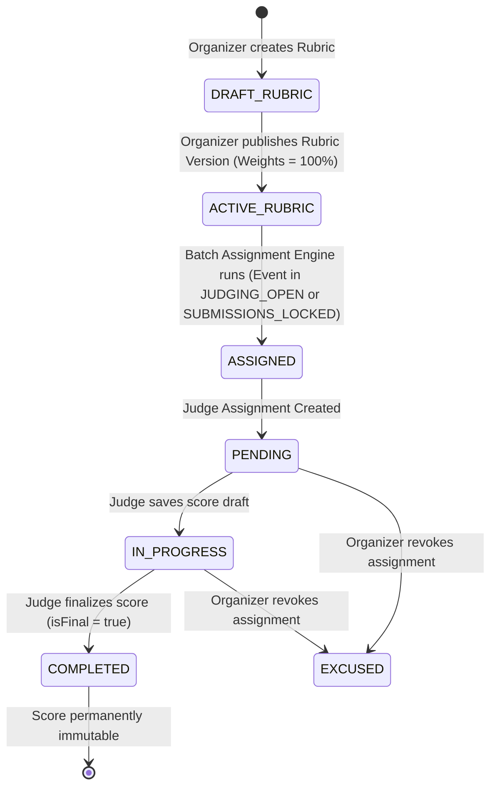
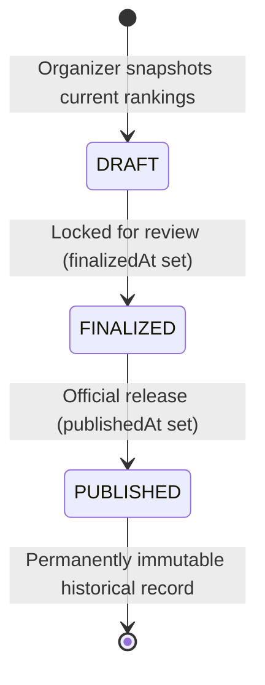

# RaptorOS — Judging Configuration, Judge Assignment & Scoring Architecture (Phase 6)

## 1. Overview & Objectives

Phase 6 establishes a defensible, deterministic, offline-first hackathon judging lifecycle for RaptorOS:
- **Rubric & Versioned Criteria**: Organizers define multi-criteria evaluation rubrics (`Rubric`, `RubricVersion`, `RubricCriterion`). Criteria weights are strictly enforced (summing exactly to 100% or 1.00). Activating a rubric version locks existing versions to preserve historical evaluation integrity.
- **Deterministic Balanced Judge Assignment Engine**:
  - Pre-computed conflict detection: Automatically prevents judges from evaluating projects from teams they created, lead, or belong to.
  - Uniform workload balancing: Iteratively assigns projects to judges with the fewest existing active assignments.
  - Minimum judge coverage guarantee: Ensures every eligible submission receives up to `judgesPerProject` independent evaluations.
  - Deterministic tie-breaking: Stable sorting ensures reproducibility in audit inspections.
  - Assignment batches: Tracks generation batches (`AssignmentBatch`) with configuration metadata, total assignments created, and creator identity.
- **High-Precision Decimal Scoring**:
  - Draft saving vs. finalization: Judges can iteratively score criteria and write feedback drafts.
  - Atomic finalization: Validates all rubric criteria are fulfilled, computes the exact weighted score using `decimal.js`, and sets `isFinal: true`.
  - Immutable historical evidence: Finalized scores cannot be edited, re-saved, or altered.
- **Strict Lifecycle Guarding**:
  - Evaluation scoring is strictly confined to the `JUDGING_OPEN` event state.
  - Revocation of assignments marks them as `EXCUSED`, preventing orphaned scores.
- **Audit Logging**: Structured audit entries are emitted for all judging events (`RUBRIC_CREATED`, `RUBRIC_VERSION_CREATED`, `RUBRIC_PUBLISHED`, `ASSIGNMENT_BATCH_CREATED`, `ASSIGNMENT_REVOKED`, `SCORE_DRAFT_SAVED`, `SCORE_FINALIZED`).

---

## 2. Judging Lifecycle State Machine



---

## 3. Rubric & Criteria Management

### Schema Representation
Rubrics belong to an Event and can optionally be targeted to specific Tracks (`trackId`).
- `Rubric`: Top-level rubric container.
- `RubricVersion`: Immutable version snapshot containing an integer `versionNumber` and `isActive` flag. Only one version per rubric can be active at any given time.
- `RubricCriterion`: Individual evaluation metric specifying `title`, `description`, `weight` (`Decimal(5, 2)`), and `maxPoints` (`Decimal(5, 2)`).

### Weight Normalization & Strict Validation
Weights must sum exactly to 100 (percentage mode) or 1.00 (fractional mode), verified using `decimal.js` with an epsilon tolerance of $1 \times 10^{-6}$:
```typescript
export function validateCriteriaWeights(
  criteria: Array<{ weight: Decimal | number | string }>
): { valid: boolean; total: Decimal; error?: string }
```

When a new version is published (`/api/events/[eventId]/rubrics/[rubricId]/publish`), the platform atomically deactivates all other versions under that rubric and activates the selected version within a database transaction.

---

## 4. Balanced Assignment Algorithm & Conflict Detection

The assignment engine (`server/services/assignment.service.ts`) executes a deterministic 5-step process:

1. **Pre-compute Conflict Matrix**:
   - For all candidate judges, the algorithm queries their team affiliations (`TeamMember`) and team creations (`Team.createdById`) across the event.
   - Any team to which a judge belongs or has led is marked in a `conflictMap: Set<string>`.
2. **Filter Eligible Submissions**:
   - Only submissions in `SUBMITTED` or `LOCKED` status are eligible for assignment.
   - If `trackId` is specified, filtering scopes exclusively to projects in that track.
3. **Capacity & Existing Workload Analysis**:
   - Loads existing active assignments (`PENDING`, `IN_PROGRESS`, `COMPLETED`).
   - Computes each judge's remaining capacity (`maxProjectsPerJudge - currentLoad`).
4. **Deterministic Greedy Load-Balancing**:
   - Submissions are ordered by lowest existing assignment count, tie-broken by `submission.id`.
   - Judges are sorted by lowest current assigned workload, tie-broken by `judge.id`.
   - For each submission needing additional reviews, the engine selects non-conflicted judges with remaining capacity who haven't already been assigned to that submission.
5. **Atomic Batch Persistence**:
   - The engine creates an `AssignmentBatch` record with the generation parameters.
   - Inserts all generated assignments with foreign key references to the batch, emitting an `ASSIGNMENT_BATCH_CREATED` audit log.

---

## 5. High-Precision Scoring & Immutability

### Score Calculation Formula
For a rubric version with criteria $C_1, C_2, \dots, C_n$, where criterion $i$ has weight $w_i$, maximum points $M_i$, and raw awarded points $p_i$:

$$\text{Weighted Score} = \sum_{i=1}^{n} \left( \frac{p_i}{M_i} \times w_i \right)$$

If weights are expressed as percentages (summing to 100), the platform normalizes the raw score against 100 to yield the definitive normalized weighted score. All intermediate calculations use `Decimal` to avoid IEEE 754 floating-point inaccuracies.

### Immutability Guarantees
1. **Draft Mode**: Score entries with `isFinal: false` can be updated by the assigned judge while the event remains in `JUDGING_OPEN`.
2. **Finalization (`finalizeScore`)**:
   - Verifies that all criteria defined in the active rubric version have scores.
   - Verifies that $0 \le p_i \le M_i$ for all criteria.
   - Atomically updates the assignment status to `COMPLETED` and marks the score `isFinal = true`.
   - **Hard Guard**: Any subsequent call to save or finalize an assignment with `isFinal === true` rejects immediately with `FORBIDDEN: Score has been finalized and cannot be modified`.

---

## 6. Security & Audit Logging

| Action | Target | Log Event Type | Metadata Recorded |
| :--- | :--- | :--- | :--- |
| Create Rubric | `Rubric` | `RUBRIC_CREATED` | `rubricId, eventId, trackId` |
| Version Rubric | `RubricVersion` | `RUBRIC_VERSION_CREATED` | `versionId, versionNumber, criteriaCount` |
| Publish Rubric | `RubricVersion` | `RUBRIC_PUBLISHED` | `versionId, versionNumber` |
| Run Assignment Batch | `AssignmentBatch` | `ASSIGNMENT_BATCH_CREATED` | `batchId, totalAssigned, judgesPerProject` |
| Revoke Assignment | `JudgeAssignment` | `ASSIGNMENT_REVOKED` | `assignmentId, judgeId, submissionId` |
| Draft Score | `Score` | `SCORE_DRAFT_SAVED` | `assignmentId, scoreId, criteriaCount` |
| Finalize Score | `Score` | `SCORE_FINALIZED` | `assignmentId, scoreId, totalScore` |
| Run Normalization | `NormalizationRun` | `NORMALIZATION_RUN_CREATED` | `runId, version, method, scoresCount, judgesCount` |
| Create Result Snapshot | `ResultSnapshot` | `RESULT_SNAPSHOT_CREATED` | `snapshotId, version, projectCount` |
| Finalize Results | `ResultSnapshot` | `RESULTS_FINALIZED` | `snapshotId, version` |
| Publish Official Results | `ResultSnapshot` | `RESULTS_PUBLISHED` | `snapshotId, version, publishedAt` |

---

## 7. Score Normalization Engine (Phase 7)

Score normalization eliminates grading variance across judges (leniency vs. severity bias) while strictly preserving immutable raw scores (`Score.rawScore` and `ScoreItem.rawScore`).

### Invariant Guarantees
1. **Raw Score Immutability**: Normalization runs produce separate `NormalizedScore` records linked to versioned `NormalizationRun` runs. Raw evaluations in `Score` and `ScoreItem` are never modified or overwritten.
2. **Deterministic Reproducibility**: High-precision `Decimal` arithmetic ensures identical calculations across all host architectures.

### Mathematical Formulations

#### 1. Population Standard Deviation Convention
For a judge $j$ with $N$ finalized scores $x_1, x_2, \dots, x_N$ and mean $\mu_j = \frac{1}{N}\sum_{i=1}^{N} x_i$:

$$\sigma_j = \sqrt{\frac{1}{N} \sum_{i=1}^{N} (x_i - \mu_j)^2}$$

#### 2. Z-Score Normalization (Standard Deviation Scaled / T-Score)
Z-scores are transformed into intuitive, positive scale values centered around $50.00$ with standard deviation scaling of $15$ points, clamped to $[0, 100]$:

$$z = \frac{x - \mu_j}{\sigma_j}$$

$$T(z) = \max\left(0, \min\left(100, 50.00 + 15.00 \cdot z\right)\right)$$

#### 3. Min-Max Normalization (0–100 Scaled)
Maps each judge's score distribution onto a uniform relative percentage span:

$$\text{MinMax}(x) = \frac{x - \min_j}{\max_j - \min_j} \times 100.00$$

#### 4. Safe Zero-Variance Handling (Edge Case Safeguard)
When a judge awards uniform scores to all evaluated submissions ($\sigma_j = 0$ or $\max_j = \min_j$) or only evaluates a single project ($N = 1$):
- Division by zero is safely intercepted.
- The normalized value defaults deterministically to **$50.00$**.
- Submissions are neither discarded nor biased.

---

## 8. Judge Calibration Analytics & Outlier Detection (Phase 7)

The platform evaluates judge behavior to provide organizers with objective calibration signals:

- **Metrics Calculated**: Mean ($\mu$), Median ($Q_2$), Population Standard Deviation ($\sigma$), Minimum, Maximum, and Range ($\max - \min$).
- **Severity Indicator**:
  - `LENIENT`: Judge mean is more than $0.5\sigma$ above overall event mean.
  - `STRICT`: Judge mean is more than $0.5\sigma$ below overall event mean.
  - `BALANCED`: Within $\pm 0.5\sigma$ baseline.
- **Spread Indicator**:
  - `HIGH_DISCRIMINATION`: Judge std dev $> 1.25\times$ overall std dev.
  - `COMPRESSED`: Judge std dev $< 0.75\times$ overall std dev.
  - `MODERATE`: Within expected distribution spread.
- **Outlier Detection**: Evaluations where $|z_i| \ge \text{threshold}$ (default $|z| \ge 2.0$) are flagged for organizer review to identify anomalies or rogue scores.

---

## 9. Deterministic Multi-Tier Ranking & Tie-Breaking (Phase 7)

Projects are ranked through an immutable 4-tier tie-breaking policy:

1. **Tier 1 — `finalScore` (Descending)**:
   The aggregate normalized score (or raw aggregate score if normalization is not applied).
2. **Tier 2 — `rawAggregateScore` (Descending)**:
   If normalized scores are identical, the uncalibrated raw aggregate breaks the tie.
3. **Tier 3 — `variance` (Ascending)**:
   If scores remain identical, lower judge variance (higher consensus/agreement among evaluators) is favored.
4. **Tier 4 — `submissionId` (Lexicographical Ascending)**:
   Stable, deterministic fallback that prevents non-deterministic sorting across runtime engines.

---

## 10. Result Snapshot Lifecycle & Public Disclosure (Phase 7)

Ranked results progress through a durable governance lifecycle:



### Sanitized Public Disclosure
When results are released to the public gallery and official results page (`/events/[eventId]/results`):
- Private judge identities, email addresses, individual judge marks, and calibration metrics are **strictly excluded**.
- Only finalized rankings, awards, project descriptions, team names, and links are projected.
- Events with unpublished results display an informative status screen with zero data leakage.

