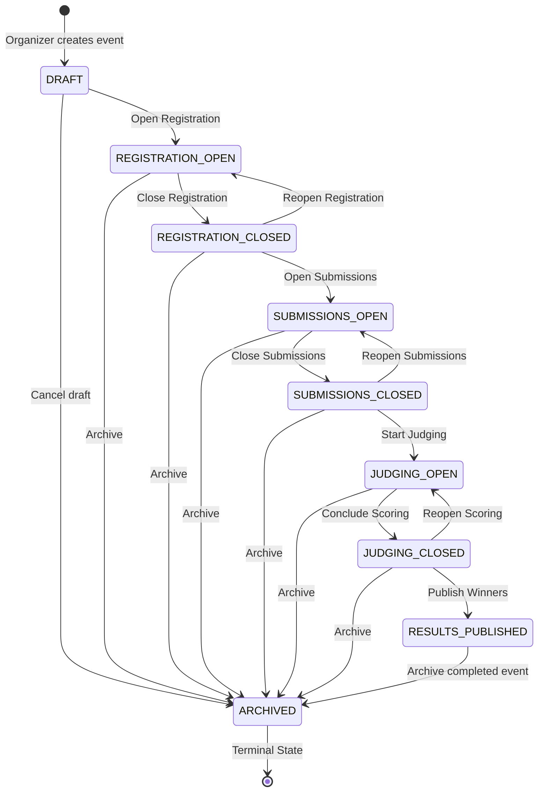

# RaptorOS Event Lifecycle, Registration & Team Workflows

This document specifies the operational lifecycle, state machine, registration constraints, and team formation rules implemented in **RaptorOS Phase 4**.

---

## 1. Event Lifecycle State Machine

RaptorOS implements a strict, server-side state machine governing the operational phases of every hackathon.

### 1.1 Transition Table & Business Rules

| Current State | Permitted Next States | Business Rule Enforced |
| :--- | :--- | :--- |
| `DRAFT` | `REGISTRATION_OPEN`, `ARCHIVED` | Event is invisible in public discovery catalog. Organizer configures rules, tracks, prizes, and team limits. |
| `REGISTRATION_OPEN` | `REGISTRATION_CLOSED`, `ARCHIVED` | Visible to public. Authenticated users can register as `PARTICIPANT`. Registered participants can form or join teams. |
| `REGISTRATION_CLOSED` | `SUBMISSIONS_OPEN`, `REGISTRATION_OPEN`, `ARCHIVED` | New participant registrations rejected. Existing registered participants can continue configuring teams. |
| `SUBMISSIONS_OPEN` | `SUBMISSIONS_CLOSED`, `ARCHIVED` | Teams can submit project repositories, demo videos, and technical descriptions. |
| `SUBMISSIONS_CLOSED` | `JUDGING_OPEN`, `SUBMISSIONS_OPEN`, `ARCHIVED` | Submissions frozen and immutable. No new submissions or edits permitted. |
| `JUDGING_OPEN` | `JUDGING_CLOSED`, `ARCHIVED` | Assigned judges evaluate projects against versioned rubrics. |
| `JUDGING_CLOSED` | `RESULTS_PUBLISHED`, `JUDGING_OPEN`, `ARCHIVED` | Scores frozen. Organizers run normalization algorithms and review rankings. |
| `RESULTS_PUBLISHED` | `ARCHIVED` | Winners, rankings, and certificates are publicly visible. |
| `ARCHIVED` | *(None - Terminal)* | Read-only historical archive. All write operations disabled. |

---

## 2. Participant Registration Workflow

1. **Discovery**: Authenticated and unauthenticated users can browse public hackathons at `/events`. Events in `DRAFT` state are excluded from public discovery.
2. **Registration Eligibility**:
   - Event must be in `REGISTRATION_OPEN` state.
   - If `registrationStart` is set, current server time must be >= start date.
   - If `registrationEnd` is set, current server time must be <= end date.
3. **Atomic Enrollment**:
   - `POST /api/events/:eventId/register` creates an `EventMembership` with `role: PARTICIPANT` and `status: ACTIVE`.
   - Re-registration after cancellation reactivates the membership.
   - Duplicate active registration throws `ConflictError`.
4. **Cancellation**:
   - Participants can cancel their registration (`DELETE /api/events/:eventId/register`).
   - If the participant is a member of a team, they must leave or disband the team before cancelling registration.

---

## 3. Team Formation & Management

### 3.1 Constraints & Invariants
- **Single Team Per Event**: A participant can belong to at most one team per hackathon (`teamService.getUserTeamInEvent`).
- **Event-Scoped Team Isolation**: Team slugs are unique within an event (`@@unique([eventId, slug])`). Distinct events can use identical team names.
- **Team Size Bounds**: Enforced via `minTeamSize` and `maxTeamSize` (default: 1–4 members).

### 3.2 Secure Invitation Workflow
To eliminate plain-text tokens in persistence and prevent timing attacks:
1. **Creation**: Captain invites an email via `POST /api/teams/:teamId/invitations`.
2. **Token Generation**: A 64-character cryptographically secure hex token is generated using `crypto.randomBytes(32)`.
3. **SHA-256 Hashing**:
   $$\text{tokenHash} = \text{sha256}(\text{rawToken})$$
   Only `tokenHash` is stored in the `TeamInvitation` database table.
4. **Validation & Acceptance**:
   - Invitee receives the raw token and calls `POST /api/invitations/:id/accept`.
   - Server re-hashes the provided raw token and compares with `tokenHash`.
   - Capacity check verifies `team.members.length < event.maxTeamSize`.
   - Invitee is enrolled as `TeamMember` with role `MEMBER`.
   - Invitation is marked `ACCEPTED`.

### 3.3 Team Leadership & Lifecycle
- **Captain Creation**: The creator of a team is automatically assigned the `LEADER` role.
- **Member Departure**: Regular members can freely leave a team via `POST /api/teams/:teamId/leave`.
- **Captain Departure**:
  - If other members exist, leadership is automatically transferred to the next oldest active member.
  - If the captain is the sole member, leaving the team atomically disbands and deletes the team.
- **Member Removal**: Captains can remove members via `DELETE /api/teams/:teamId/members/:userId`. Regular members cannot kick other participants.

---

## 4. REST API Endpoint Reference

### 4.1 Event Management
- `GET /api/events` — List public events.
- `POST /api/events` — Create new event (auto-assigns creator as `ORGANIZER`).
- `GET /api/events/:eventId` — Retrieve event details.
- `PATCH /api/events/:eventId` — Update event configuration (Requires `ORGANIZER` or `ADMIN`).
- `POST /api/events/:eventId/transition` — Transition lifecycle state (Requires `ORGANIZER` or `ADMIN`).
- `GET /api/events/:eventId/tracks` — List event tracks.
- `POST /api/events/:eventId/tracks` — Create event track.
- `GET /api/events/:eventId/prizes` — List event prizes.
- `POST /api/events/:eventId/prizes` — Create event prize.

### 4.2 Registration
- `POST /api/events/:eventId/register` — Register current user as `PARTICIPANT`.
- `DELETE /api/events/:eventId/register` — Cancel registration.
- `GET /api/events/:eventId/participants` — List enrolled participants (Requires `ORGANIZER`).

### 4.3 Teams & Invitations
- `GET /api/events/:eventId/teams` — List teams in event.
- `POST /api/events/:eventId/teams` — Create team (Requires event registration).
- `POST /api/teams/:teamId/invitations` — Send team invitation (Requires Captain).
- `POST /api/invitations/:id/accept` — Accept invitation with raw token.
- `POST /api/invitations/:id/reject` — Reject invitation.
- `POST /api/teams/:teamId/leave` — Leave team (triggers auto-transfer or disband).
- `DELETE /api/teams/:teamId/members/:userId` — Remove member (Requires Captain).
