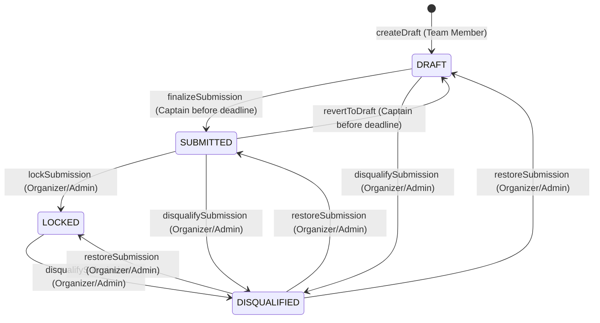

# RaptorOS — Submission Workflow & Public Gallery Architecture (Phase 5)

## 1. Overview & Objectives

Phase 5 establishes a complete, secure, offline-first hackathon project submission lifecycle and public gallery for RaptorOS:
- **Draft Preparation & Snapshots**: Teams prepare project drafts and versioned immutable snapshots (`SubmissionVersion`).
- **Authorization & Captain Authority**: Only the team captain (`LEADER`) can submit the official entry.
- **Single Submission Constraint**: Exactly one submission per team per event (`@@unique([eventId, teamId])`).
- **Deadline Enforcements**: Submissions are allowed only when the event is in `SUBMISSIONS_OPEN` status and prior to `submissionsEnd`.
- **Minimum Team Capacity**: Teams must satisfy the event's `minTeamSize` requirement upon final submission.
- **Cross-Event Isolation**: Projects cannot associate with tracks belonging to a different hackathon.
- **Sanitization & Safe URL Scheme Allowlist**: All user-provided external links are validated against an allowlist (`http:`, `https:`) and reject dangerous protocol injections (`javascript:`, `data:`, `file:`, etc.).
- **Audit Logging**: All lifecycle changes trigger structured audit logs (`SUBMISSION_CREATED`, `SUBMISSION_SUBMITTED`, `SUBMISSION_LOCKED`, `SUBMISSION_DISQUALIFIED`, `SUBMISSION_RESTORED`).
- **Public Showcase & Gallery**: Filtered by event and track, searchable by keywords, paginated, and strictly omitting private user details or unsubmitted drafts.

---

## 2. Submission State Machine

The submission lifecycle enforces strict server-side state transitions:



### Transition Rules
1. **DRAFT $\rightarrow$ SUBMITTED**:
   - Allowed when event is in `SUBMISSIONS_OPEN` state.
   - Allowed only prior to `submissionsEnd` deadline.
   - Actor must be the team captain (`LEADER`).
   - Team membership count $\ge$ event `minTeamSize`.
   - Generates an immutable snapshot `SubmissionVersion` incrementing `versionNumber`.
2. **SUBMITTED $\rightarrow$ DRAFT**:
   - Allows participants to edit before the deadline.
3. **SUBMITTED $\rightarrow$ LOCKED**:
   - Organizer administrative freeze at deadline or start of judging.
4. **Any $\rightarrow$ DISQUALIFIED**:
   - Organizers can disqualify entries violating rules.
   - Disqualified projects are omitted from the public gallery.
5. **DISQUALIFIED $\rightarrow$ Previous State**:
   - Organizers can restore a project after appeals.

---

## 3. Security & Cross-Event Isolation

### URL Scheme Allowlist & Sanitization
The sanitizer (`lib/utils/sanitizer.ts`) enforces:
```typescript
const parsed = new URL(trimmed);
if (parsed.protocol !== "http:" && parsed.protocol !== "https:") {
  throw new ValidationError(`${fieldName} must use http:// or https:// protocol.`);
}
```
Rejects attempts to inject `javascript:alert(1)`, `data:text/html,...`, or local files.

### Cross-Event Track Injection Blocking
Validates that any selected track matches the submission's event:
```typescript
if (track.eventId !== eventId) {
  throw new ValidationError(`Cross-event track injection rejected: Track '${track.name}' does not belong to this hackathon.`);
}
```

### Public DTO Sanitization
The public gallery service (`server/services/gallery.service.ts`) converts database records into safe `PublicSubmissionDTO` payloads:
- Excludes participant email addresses, password hashes, and session tokens.
- Restricts visibility strictly to projects in `SUBMITTED` or `LOCKED` states.
- Rejects requests for `DRAFT` or `DISQUALIFIED` submissions via public routes with 404 `NotFoundError`.

---

## 4. REST API Reference

| Endpoint | Method | Role Required | Description |
|---|---|---|---|
| `/api/events/[eventId]/submissions` | `POST` | Team Member | Creates initial draft and version v1 snapshot |
| `/api/events/[eventId]/submissions` | `GET` | Authenticated | Lists submissions (team-scoped or organizer view) |
| `/api/submissions/[submissionId]` | `GET` | Authorized Member / Organizer | Retrieves submission and full version history |
| `/api/submissions/[submissionId]` | `PATCH` | Team Member | Updates draft fields before deadline |
| `/api/submissions/[submissionId]/submit` | `POST` | Team Captain (`LEADER`) | Finalizes and freezes project submission |
| `/api/submissions/[submissionId]/lock` | `POST` | Organizer / Admin | Organizers lock submission for judging |
| `/api/submissions/[submissionId]/disqualify`| `POST` | Organizer / Admin | Disqualifies submission |
| `/api/submissions/[submissionId]/restore` | `POST` | Organizer / Admin | Restores a disqualified submission |
| `/api/gallery` | `GET` | Public | Public project showcase with filters & pagination |
| `/api/gallery/[submissionId]` | `GET` | Public | Public detail view of eligible submission |
